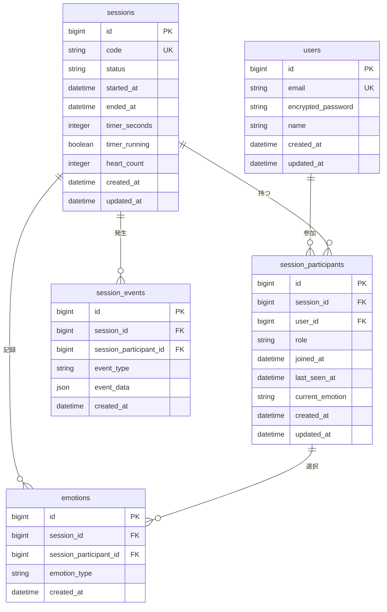

# データベース設計書：RRFull

## ER図



---

## テーブル定義

### 1. users（ユーザー）

| カラム名 | 型 | NULL | デフォルト | 説明 |
|---------|-----|------|-----------|------|
| id | bigint | NO | AUTO_INCREMENT | 主キー |
| email | varchar(255) | NO | - | メールアドレス（一意） |
| encrypted_password | varchar(255) | NO | - | 暗号化パスワード |
| name | varchar(100) | YES | NULL | 表示名 |
| remember_created_at | datetime | YES | NULL | Remember me機能用 |
| sign_in_count | integer | NO | 0 | ログイン回数 |
| current_sign_in_at | datetime | YES | NULL | 最終ログイン日時 |
| last_sign_in_at | datetime | YES | NULL | 前回ログイン日時 |
| current_sign_in_ip | varchar(45) | YES | NULL | 最終ログインIP |
| last_sign_in_ip | varchar(45) | YES | NULL | 前回ログインIP |
| created_at | datetime | NO | CURRENT_TIMESTAMP | 作成日時 |
| updated_at | datetime | NO | CURRENT_TIMESTAMP | 更新日時 |

**インデックス:**
- UNIQUE: email
- INDEX: current_sign_in_at

---

### 2. sessions（セッション）

| カラム名 | 型 | NULL | デフォルト | 説明 |
|---------|-----|------|-----------|------|
| id | bigint | NO | AUTO_INCREMENT | 主キー |
| code | varchar(6) | NO | - | セッションコード（6文字） |
| status | varchar(20) | NO | 'waiting' | 状態（waiting/active/completed） |
| started_at | datetime | YES | NULL | 開始日時 |
| ended_at | datetime | YES | NULL | 終了日時 |
| timer_seconds | integer | NO | 0 | タイマー経過秒数 |
| timer_running | boolean | NO | false | タイマー稼働状態 |
| timer_started_at | datetime | YES | NULL | タイマー開始時刻 |
| heart_count | integer | NO | 0 | ハートカウント合計 |
| created_at | datetime | NO | CURRENT_TIMESTAMP | 作成日時 |
| updated_at | datetime | NO | CURRENT_TIMESTAMP | 更新日時 |

**インデックス:**
- UNIQUE: code
- INDEX: status
- INDEX: created_at

**制約:**
- CHECK: status IN ('waiting', 'active', 'completed')

---

### 3. session_participants（セッション参加者）

| カラム名 | 型 | NULL | デフォルト | 説明 |
|---------|-----|------|-----------|------|
| id | bigint | NO | AUTO_INCREMENT | 主キー |
| session_id | bigint | NO | - | セッションID（外部キー） |
| user_id | bigint | NO | - | ユーザーID（外部キー） |
| role | varchar(20) | NO | 'participant' | 役割（host/participant） |
| joined_at | datetime | NO | CURRENT_TIMESTAMP | 参加日時 |
| last_seen_at | datetime | NO | CURRENT_TIMESTAMP | 最終確認日時 |
| current_emotion | varchar(20) | YES | NULL | 現在の感情 |
| is_active | boolean | NO | true | アクティブ状態 |
| created_at | datetime | NO | CURRENT_TIMESTAMP | 作成日時 |
| updated_at | datetime | NO | CURRENT_TIMESTAMP | 更新日時 |

**インデックス:**
- INDEX: session_id, user_id（複合ユニーク）
- INDEX: session_id
- INDEX: user_id
- INDEX: last_seen_at

**制約:**
- FOREIGN KEY: session_id REFERENCES sessions(id)
- FOREIGN KEY: user_id REFERENCES users(id)
- UNIQUE: session_id, user_id
- CHECK: role IN ('host', 'participant')

---

### 4. emotions（感情履歴）

| カラム名 | 型 | NULL | デフォルト | 説明 |
|---------|-----|------|-----------|------|
| id | bigint | NO | AUTO_INCREMENT | 主キー |
| session_id | bigint | NO | - | セッションID（外部キー） |
| session_participant_id | bigint | NO | - | 参加者ID（外部キー） |
| emotion_type | varchar(20) | NO | - | 感情タイプ |
| created_at | datetime | NO | CURRENT_TIMESTAMP | 作成日時 |

**インデックス:**
- INDEX: session_id
- INDEX: session_participant_id
- INDEX: created_at

**制約:**
- FOREIGN KEY: session_id REFERENCES sessions(id)
- FOREIGN KEY: session_participant_id REFERENCES session_participants(id)
- CHECK: emotion_type IN ('happy', 'sad', 'thinking', 'excited', 'neutral')

---

### 5. session_events（セッションイベント）

| カラム名 | 型 | NULL | デフォルト | 説明 |
|---------|-----|------|-----------|------|
| id | bigint | NO | AUTO_INCREMENT | 主キー |
| session_id | bigint | NO | - | セッションID（外部キー） |
| session_participant_id | bigint | YES | NULL | 参加者ID（外部キー） |
| event_type | varchar(50) | NO | - | イベントタイプ |
| event_data | json | YES | NULL | イベント詳細データ |
| created_at | datetime | NO | CURRENT_TIMESTAMP | 作成日時 |

**インデックス:**
- INDEX: session_id
- INDEX: event_type
- INDEX: created_at

**制約:**
- FOREIGN KEY: session_id REFERENCES sessions(id)
- FOREIGN KEY: session_participant_id REFERENCES session_participants(id)

**イベントタイプ:**
- session_created: セッション作成
- participant_joined: 参加者参加
- participant_left: 参加者退出
- timer_started: タイマー開始
- timer_stopped: タイマー停止
- heart_added: ハート追加
- session_completed: セッション完了

---

## マイグレーションファイル

### 001_devise_create_users.rb
```ruby
class DeviseCreateUsers < ActiveRecord::Migration[7.0]
  def change
    create_table :users do |t|
      t.string :email,              null: false, default: ""
      t.string :encrypted_password, null: false, default: ""
      t.string :name
      
      # Devise trackable
      t.integer  :sign_in_count, default: 0, null: false
      t.datetime :current_sign_in_at
      t.datetime :last_sign_in_at
      t.string   :current_sign_in_ip
      t.string   :last_sign_in_ip
      
      t.timestamps null: false
    end

    add_index :users, :email, unique: true
  end
end
```

### 002_create_sessions.rb
```ruby
class CreateSessions < ActiveRecord::Migration[7.0]
  def change
    create_table :sessions do |t|
      t.string :code, null: false, limit: 6
      t.string :status, null: false, default: 'waiting'
      t.datetime :started_at
      t.datetime :ended_at
      t.integer :timer_seconds, null: false, default: 0
      t.boolean :timer_running, null: false, default: false
      t.datetime :timer_started_at
      t.integer :heart_count, null: false, default: 0
      
      t.timestamps
    end
    
    add_index :sessions, :code, unique: true
    add_index :sessions, :status
    add_index :sessions, :created_at
  end
end
```

### 003_create_session_participants.rb
```ruby
class CreateSessionParticipants < ActiveRecord::Migration[7.0]
  def change
    create_table :session_participants do |t|
      t.references :session, null: false, foreign_key: true
      t.references :user, null: false, foreign_key: true
      t.string :role, null: false, default: 'participant'
      t.datetime :joined_at, null: false, default: -> { 'CURRENT_TIMESTAMP' }
      t.datetime :last_seen_at, null: false, default: -> { 'CURRENT_TIMESTAMP' }
      t.string :current_emotion
      t.boolean :is_active, null: false, default: true
      
      t.timestamps
    end
    
    add_index :session_participants, [:session_id, :user_id], unique: true
    add_index :session_participants, :last_seen_at
  end
end
```

### 004_create_emotions.rb
```ruby
class CreateEmotions < ActiveRecord::Migration[7.0]
  def change
    create_table :emotions do |t|
      t.references :session, null: false, foreign_key: true
      t.references :session_participant, null: false, foreign_key: true
      t.string :emotion_type, null: false
      
      t.datetime :created_at, null: false
    end
    
    add_index :emotions, :created_at
  end
end
```

### 005_create_session_events.rb
```ruby
class CreateSessionEvents < ActiveRecord::Migration[7.0]
  def change
    create_table :session_events do |t|
      t.references :session, null: false, foreign_key: true
      t.references :session_participant, foreign_key: true
      t.string :event_type, null: false
      t.json :event_data
      
      t.datetime :created_at, null: false
    end
    
    add_index :session_events, :event_type
    add_index :session_events, :created_at
  end
end
```

---

## モデル定義

### User モデル
```ruby
class User < ApplicationRecord
  devise :database_authenticatable, :registerable,
         :recoverable, :rememberable, :validatable, :trackable
         
  has_many :session_participants, dependent: :destroy
  has_many :sessions, through: :session_participants
  
  validates :name, length: { maximum: 100 }
end
```

### Session モデル
```ruby
class Session < ApplicationRecord
  has_many :session_participants, dependent: :destroy
  has_many :users, through: :session_participants
  has_many :emotions, dependent: :destroy
  has_many :session_events, dependent: :destroy
  
  validates :code, presence: true, uniqueness: true, length: { is: 6 }
  validates :status, inclusion: { in: %w[waiting active completed] }
  
  before_validation :generate_code, on: :create
  
  scope :active, -> { where(status: 'active') }
  scope :recent, -> { order(created_at: :desc) }
  
  private
  
  def generate_code
    self.code = loop do
      random_code = SecureRandom.alphanumeric(6).upcase
      break random_code unless Session.exists?(code: random_code)
    end
  end
end
```

### SessionParticipant モデル
```ruby
class SessionParticipant < ApplicationRecord
  belongs_to :session
  belongs_to :user
  has_many :emotions, dependent: :destroy
  has_many :session_events, dependent: :destroy
  
  validates :role, inclusion: { in: %w[host participant] }
  validates :user_id, uniqueness: { scope: :session_id }
  
  scope :active, -> { where(is_active: true) }
  
  def online?
    last_seen_at > 5.seconds.ago
  end
end
```

---

## インデックス戦略

### パフォーマンス向上のためのインデックス

1. **高頻度アクセス**
   - sessions.code: セッション参加時の検索
   - session_participants.last_seen_at: オンライン状態の確認
   
2. **結合クエリ最適化**
   - session_participants(session_id, user_id): 複合インデックス
   
3. **時系列データ**
   - emotions.created_at: 履歴表示用
   - session_events.created_at: イベントログ表示用

---

## データ保持ポリシー

- **sessions**: 30日間保持後、completed状態のものを削除
- **emotions**: 90日間保持
- **session_events**: 90日間保持
- **users**: 退会時に論理削除（deleted_atカラム追加を検討）